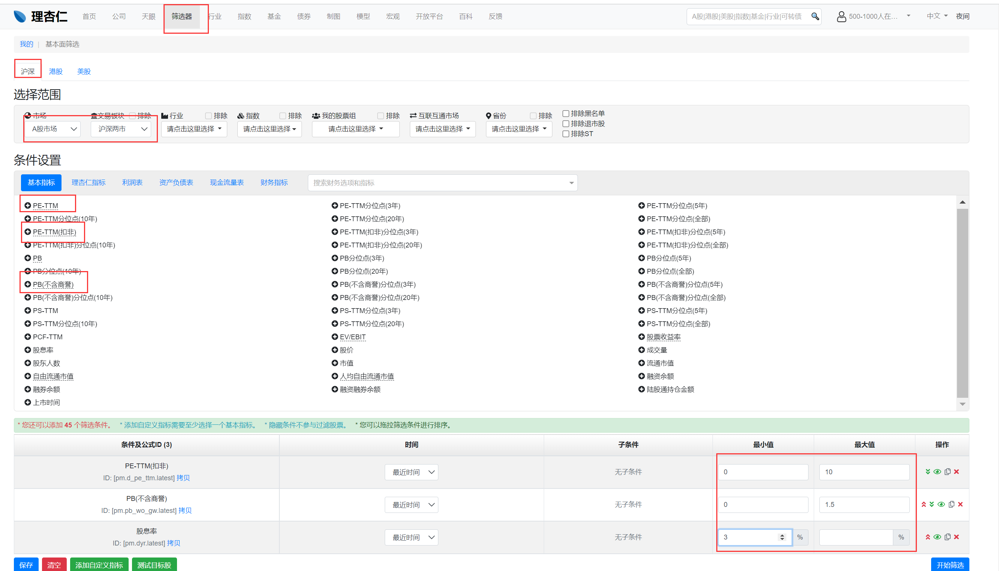
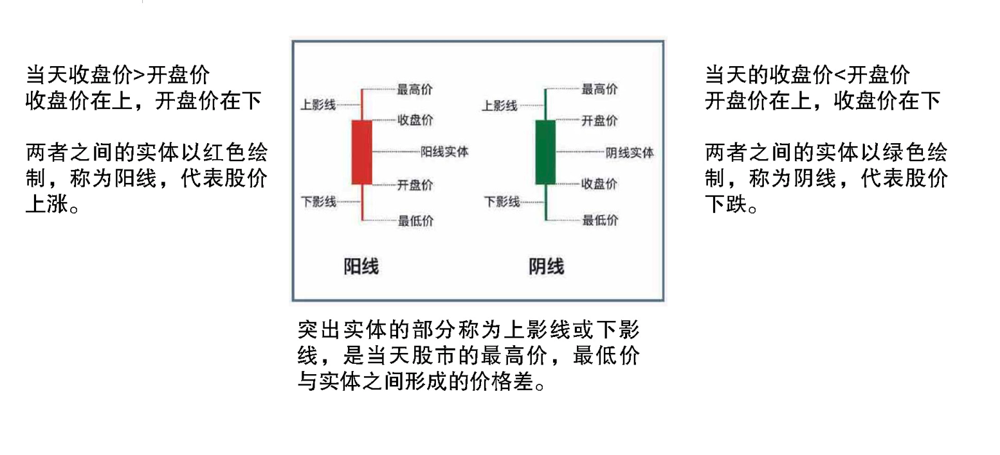

[toc]

# 学习理财 总结

## 股票初识

### 市盈率 PE

$$
PE = \frac{市值}{净利润} = \frac{买下公司需要的钱}{每年能赚到得钱}
$$

PE 是从企业盈利的角度考察现在的股价是不是合理。PE越小，回本年限越短，越有投资价值。把大于 50%的分位点称为高， 把小于 50%的分位点称为低。  

### 市净率 PB

$$
PB = \frac{市值}{净资产} = \frac{买下公司需要的钱}{属于公司自己的资产}
$$

PB 是从企业的净资产角度考察现在的股价是不是合理，市值是由市场中的股民等等得出来的，净资产是公司实实在在资产。PB越小，公司被低估，越有投资价值。把大于 50%的分位点称为高， 把小于 50%的分位点称为低。

### 沪深300和中证500的估值判断入场时机

当沪深300、中证500中任意一个的PE和PB同时满足：

* PE处于近十年数值的0-50%内

* PB处于近十年数值的0-20%区间内

则认为他们是低估状态，可以入场投资

### 理杏仁 查看估值

打开[理杏仁](www.lixinger.com)，在搜索框中搜索“沪深300”指数，按照如下图片进行筛选操作

### 规避非系统性风险

* 持有4-8只股票是比较经济、有效的做法

* 分散行业，同行业的资金占比不超过30%

### 寻找高投资回报率股票

#### 投资收益率

$$
投资回报率 = (\frac{卖出价格}{买入价格} - 1) \times100\%
$$

#### 净资产收益率ROE

$$
ROE = \frac{净利润}{净资产}
$$

代表企业用一元钱的净资产能够赚取多少净利润，也就是带来多少投资回报，代表了企业的赚钱能力。**ROE越高，股票的年华收益率就越高**

#### 投资收益率和净资产收益率关系

长期持有一只股票的投资回报和 ROE 近似，  ROE 代表企业的赚钱能力， 从长期来看， 一只股票的回报率与企业的发展息息相关， 如果一家企业的 ROE 是 40 年来一直 6%左右， 那么 40 年后你的投资回报也不会有太大变化。 即使是买的很便宜（就是 PE 很低的情况下买的） 如果企业在 20-30 年内的盈利都是资本的 18%， 即使买的股票不太“便宜’,其回报也会令人满意。       

#### 年报和季度财报时间

公司一季报会在当年 4 月 1 日-4 月 30 日这个时间段公布，而中报会在当年 7 月 1 日-8 月 31 日这个时间段公布， 三季报的公布时间是当年 10 月 1 日-10 月 31 日； 年报因为需要审计， 耗时比较多， 所以公布时间比较长， 会在下一年的 1 月 1 日-4 月 30 日这个时间段公布。

| 财报类别     | 反应公司业绩时间段          | 公布时间                     |
| ------------ | --------------------------- | ---------------------------- |
| 2020年一季度 | 2020年1月1日-2020年3月31日  | 2020年4月1日-2020年4月31日   |
| 2020年二季度 | 2020年1月1日-2020年6月30日  | 2020年7月1日-2020年8月31日   |
| 2020年三季度 | 2020年1月1日-2020年9月30日  | 2020年10月1日-2020年10月31日 |
| 2020年四季度 | 2020年1月1日-2020年12月31日 | 2021年1月1日-2021年4月30日   |

总结：第一季度的财报要 5 月才能查到。第二季度的要 9 月份。第三季度要 11 月。年报要等到明年 4 月。  

#### 筛选条件

* ROE连续7天 >= 15%
* 上市时间大于5年 

[i问财](http://www.iwencai.com/unifiedwap/home/index)中搜索：（现在是2021年5月15日）

**2014年到2020年ROE >= 15%，2021年3月31日ROE>=3.75%，上市时间早于2016年5月**

* 2021年3月31日ROE>=3.75%

  因为现在是2021年5月，已经过了一个季度了。将年化收益率平均到一个季度则为3.75%

* 上市时间早于2016年5月

  因为需要满足上市时间大于5年，所以需要将当前时间减去5年

 理杏仁查找：右上角搜索公司名称→点击左边第一行公司→点击第三行“盈利分析”  

### 经济周期

经济周期就是国民经济呈现扩张与紧缩交替的波动变化。这种变化必然发生、循环往复，因此形成了的经济波动。

#### 周期性行业

业绩与经济周期息息相关，繁荣时期赚的盆满钵满，萧条时业绩一落千丈：如汽车

#### 非周期性行业

受经济周期的影响较小，经营业绩更为稳定：如医药行业、食品行业。

* 作为工业基础原材料的大宗商品相关行业

  采掘服务、钢铁、化工合成材料、化工新材料、石油矿业开采、有色冶炼加工、化学制品等；

* 航运业

  远洋运输、港口航运、机场航运、交运设备服务等；

* 非生活必需品行业，及与之相关的行业

  国防军工、汽车整车、汽车零部件、建筑材料、建筑装饰、房地产等

* 非银行的金融行业

  证券、保险等；

#### 查看股票对应行业

打开[i问财](www.iwencai.com/)，搜索：**2014年到2020年ROE >= 15%，2021年3月31日ROE>=3.75%，上市时间早于2016年5月**，*行业*

(注意：后面搜索框需要添加 “行业”这一个关键词)

按照下图进行筛选行业

#### 容易产生垄断的行业：

白酒行业、 医药行业、 软件行业、 媒体行业、 消费行业  

### 判断股票业绩下滑

#### 年度营收增长率

$$
年度营收增长率 = \frac{(本年的营收收入-去年的营收收入)}{去年的营业收入}
$$

#### 年度净利润增长率

$$
年度净利润增长率 = \frac{(本年的净利润-去年的净利润)}{去年的净利润}
$$

#### 季度营收增长率

$$
季度营收增长率=\frac{(本季度的营收收入-去年同季度的营收收入)}{去年同季度的营收收入}
$$

#### 季度利润增长率

$$
季度增长率 = \frac{(本季度的净利润-去年同季度的净利润)}{去年同季度的净利润}
$$

打开[i问财](www.iwencai.com/)，搜索：**2014年到2020年ROE >= 15%，2021年3月31日ROE>=3.75%，上市时间早于2016年5月，行业，2021年3月31日营收增长率，2021年3月31日净利润增长率，2020年营收增长率，2020年净利润增长率**

### 四象限判断一个公司的状态

* 第一象限： 高 PB， 高 PE。建议别碰。
* 第二象限： 低 PB， 高 PE。一般都是企业处于低谷， 如果企业盈利恢复的确定性很高，
  那依旧还是金子。  
* 第三象限： 低 PB， 低 PE。 一般就会存在较大的投资机会， 但要警惕的特例是低估值陷
  阱。  
* 第四象限： 高 PB， 低 PE  。建议别碰。

**二三象限是低估的公司，可以选择投资**，下面一次对四个象限进行说明：

####  第一象限

高 PB， 高 PE。它是泡沫象限，  说明整个市场越贵， 下跌的可能越大。 

#### 第四象限

高 PB， 低 PE  。一家公司的 PB 高， 意味着投资者们特别看好公司的发展， 对公司的盈利能
力有着很高的期待， 毕竟市场给予了比净资产高很多倍的溢价。PE低可能反应的是**公司盈利很不错**，但是有一个问题是：**公司的盈利是可持续的还是短期**，如果是短期那么等过了这个热门的话题后，将会大跌。

 #### 第二象限

低 PB， 高 PE。高 PE 说明公司目前的经营不佳， 处于盈利较低状态。此时**市场也会对公司表现不佳的盈利状况作出反应， 表现为股价不断下跌， 市值不断下跌**。但是净资产短时间内变化不大。所以会**导致PB降低**。一般盈利降低有两种情况：

* 第一种情况是， 企业目前盈利低下的原因是企业自身经营不善， 这种盈利能力的下降是永久性的， 这种企业我们坚决要避开。  
* 第二种情况是， 企业目前盈利很低甚至出现巨额亏损的原因是， 该企业属于周期性行业， 而此时恰好整个行业处于周期性低谷。  

周期行业的行业周期是不断变化的， 现在处于低谷， 未来会逐渐回暖， 一旦行业进入上升期， 企业的盈利会逐渐好转， 目前看起来的高 PE 会降低， 股价也会随之提升。  

#### 第三象限

如果公司出现这种估值现象， 那大概率是比较合适的投资机会。出现低 PE 和低 PB 可能是因为两种情况：

* 第一种情况， 市场处于熊市的末期， 此时由于熊市长期的下跌导致大家的投资情绪都过于悲观，会使得很多股票的价格跌到实际价值以下，出现大量的低 PB、低 PE 股票， 这时候意味着， 投资的机会来了。  
* 第二种情况， 是企业遭遇经营困境、 或行业政策、 竞争态势等外部环境发生不利变化。  这个时候， 由于市场有时会提前并且迅速做出反应， 导致公司股价下降， 市值变得很低， 自然的 PB 就会很低。而 PE 的低， 有**真“低”和假“低”**
  * 真“低”：  这种情况下， 公司财报中的数据已经显示出公司盈利能力的下降， 投资者们看到公司盈利下降了， 纷纷卖出， 公司市值必然下降， 市值与净利润同时下降导致的低 PE， 就是 PE“真低” 。 只要公司未来盈利能力可以恢复， 就是好的入场时机。  
  * 假“低”：  因为公司业绩的披露有滞后性， 而 PE 的计算又是基于最近披露的净利润，所以当最近一期公司财报并没有显示出业绩下滑， 也就是说净利润仍然是高的，pe=市值/净利润， 公司的 PE 依然很低。一旦未来公司财报显示出公司的盈利能力快速下滑， 那很可能会出现股价越跌， PE 越高的情况。**因为虽然股价在下跌， 但盈利下跌速度更快， 可能直接跌成负的了**。  

### 财报

#### 利润表

主要体现公司一段时间内是赚钱还是亏钱

#### 营业利润

$$
营业利润 = 营业收入-营业成本-三费
$$

* 营业成本

  购买生产物的原料等付出的成本

* 三费

  管理费用，销售费用，财务费用

* 应收账款

  企业卖给用户，但没收到的钱

* 应收票据

  是由付款人或收款人签发，由付款人承诺，到期无条件付款的一种书面凭证。营收票据按承诺人不同分为商业承诺汇票和银行承诺汇票

* 其他应收款

  是指企业除应收票据，应收账款，预付账款，应收股利和应收利息以外的其他各种应收及暂付款项

* 预收帐款

  是指企业向购货方预收的购货定金或部分贷款

* 存货

  是指企业在日常活动中持有以备出售的产生品或商品，处在生成过程中的在产品，在生产过程或提供劳务过程中耗用的材料或物料等，包括各种类材料，在产品，半成品，产成品或库存商品以及包装物，低值易耗品，委托加工物资等

* 营业收入

  卖东西的收入。需要注意的是：**公司只要给了货，无论是否收到了钱，都会计入营业收入。但是客户如果提前付预款却没发货，则不算收入。**

#### 净利润

$$
净利润 = 营业利润-所得税
$$

#### 资产负债表

记录特定的某一天，公司的钱，财，物，债信息

#### 现金流量表

开支流水帐，记录了公司花去了多少钱，收到了多少钱

#### 资产负债表

| 资产     | 负债     | 所有者权益 |
| -------- | -------- | ---------- |
| 货币资金 | 应付账款 | 资本公积金 |
| 应收帐款 | 短期借款 | 未分配利润 |
| 存货     | 长期借款 |            |
| 预付款项 |          |            |
| 固定资产 |          |            |

$$
资产 = 负债 + 所有者权益
$$

#### 流动资产

一年内可以变现的资产，如货币资金、存货、预付款项；

##### 流动负债

一年内必须要还的钱，如应付账款、短期借款等

#### 流动比率

$$
流动比率=流动资产/流动负债
$$

流动比率小于1，是危险信号

#### 现金流量表

* 期初现金

* 经营活动现金流量

  这里面除了净利润，还有其他的现金流入流入，比如：收到钱没出货，那么现金流净额会增加，但净利润则不会。但是卖出货收到钱，那么净利润和现金流量都会增加

* 投资活动现金流量

* 筹资活动现金流量

* 期末现金

#### 自由现金流

$$
自由现金流=经营活动产生的现金流量净额-资本开支
$$

资本开支是现金流量表种的“购建固定资产、无形资产和其他长期资产支付的现金”

#### 市盈率PE-TTM（扣非）

扣非：扣除非经常性损益

非经常性损益：在利润表中属于公司利润的一部分，和公司正经经营的业务无关。有些公司，扣非净利润和非扣非净利润的计算结果相差很大。（通过非正常手段挣到的钱，不具有普遍性，存在偶然性）

[参考链接](https://zhidao.baidu.com/question/595624073.html)

#### 不含商誉的PB

商誉：公司收购其他公司时，超过该公司净资产的部分，时公司资产的一部分。比如说你现在购买某个公司，然后你给他掏了1万块钱，但是这个公司呢，他只值8000。多出来那两千就是他的商誉，因为这个公司你觉得它前景好，各种各样各方面都特别好啊，你愿意给他多掏钱

#### 股息率
$$
股息率 = 公司过去一年累计现金分红/公司市值
$$

### 选公司的标准

#### 选公司定理一：

连续两年公司的应收款上升幅度大于营业收入上升幅度，则该公司需要警惕。即：连续 2 年应收账款上升幅度-营业收入上升幅度＞0  ，理由如下

* 公司放宽信用条件来刺激销售
* 公司通过人为的通过应收账款的科目来虚构营业收入

#### 选公司定理二：

连续两年存货增长大于营业收入的增长，这家公司的存货存可能在问题。说明我囤货的量远大于卖货的量。

#### 选公司定理三：

如果一家公司的流动负债远大于流动资金的话，说明这家公司已经非常接近破产了。

#### 选公司定理四：

当一家公司的经营活动现金流量净额远大于净利润的话，说明这家公司可能有隐藏的盈利能力，有可能是座金矿

#### 选公司定理五：

自由现金流是衡量公司现金流情况的指标，代表着公司真正能自由运用的资金，比净利润更真实，更难作假

#### 白马股筛选

* ROE连续7年≥15%，上市时间＞5年
* 看公司所处行业，剔除周期股
* 剔除业绩下滑的公司
* 使用上面五条定理验证公司信息是否可靠

#### 便宜组合筛选

* 0 < PE < 10
* 0 < PB < 1.5
* 股息率 > 3%

【注意事项】

* 同一个行业的公司不要超过30%
* 看PE分位点
  * 分位点 < 20%，表示现在很低估是个机会
  * 分位点 > 50%，表示现在比较高估，不适合买入
* 每隔半年调仓一次，将组合整体估值降低

操作流程如下:

* 进入理杏仁网

* "选股" - > "筛选器"

* "选择范围" -> "A股市场" -> "沪深两市"

* "条件设置" -> "基本指标" -> 点击筛选便宜组合的**三个指标**

  

### 股票相关知识

#### 股票股利和现金股利区别

* 股票股利分红是，股票持有者的股票数量会增加，股价折半，股票总价值不变。这过程叫除权
* 现金股利分红是，股票持有者会得到现金，股票数量不变，会降低股价，股票总价值不变。这过程叫除息

价格会涨的过程叫填权。

营业收入增长幅度小于存货增长金额。说明我囤货的量远大于卖货的量。

一家公司的流动负债远大于流动资产的话，说明这家公司可能接近倒闭

当一家公司的经营活动现金流量净额远大于净利润的话，说明这家公司有隐藏的盈利能力

股息率 = 公司过去一年累计现金分红/公司市值

商誉就是说，就是比如说你现在购买这个公司去了，然后你给他掏了1万块钱，但是这个公司呢，他整个他只值8000多出来那两千就是他的商誉，因为这个公司你觉得它前景好啊，各种各样各方面都特别好啊，你愿意给他多掏钱，多掏出来这部分这个商。

非经常性损益：通过非正常手段挣到的钱，不具有普遍性，存在偶然性：

https://zhidao.baidu.com/question/595624073.html

市价委托：市价委托是只指定交易数量，但是不给出具体价格的委托方式，它能保证及时成交，但成交价格可能会偏贵

市委价格不可控，但交易时间可控

A股 T + 1 交易制度

表示投资者当天买入需要等到第二天才能卖出

存货账面余额的增长大大高于销售收入的增长一定是管理不善造成的吗？

 产品滞销，供大于求。 

 

> [跳转顶部](#学习理财 总结)